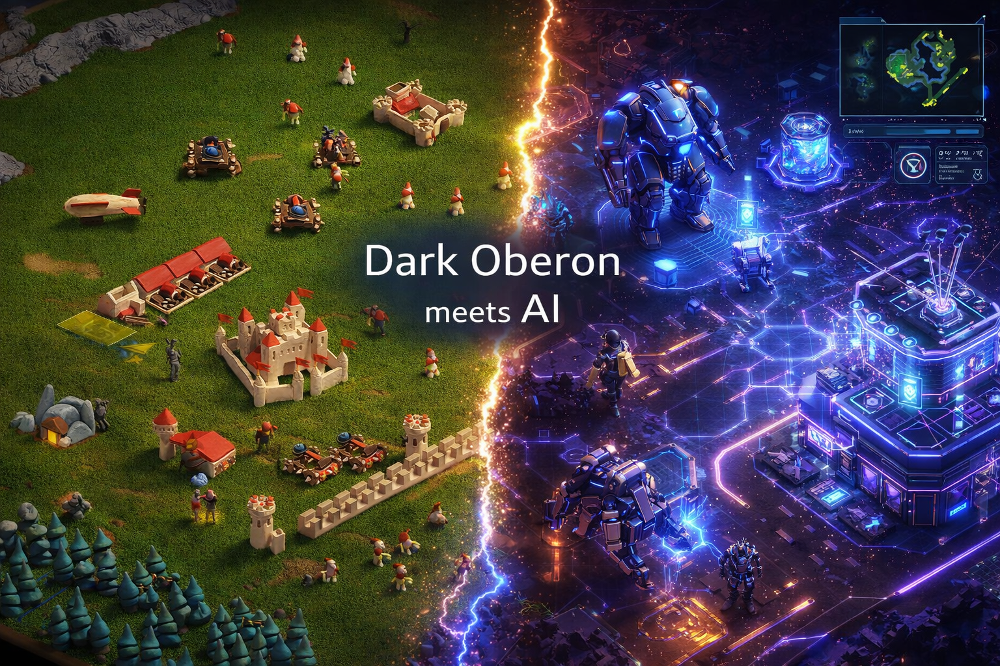
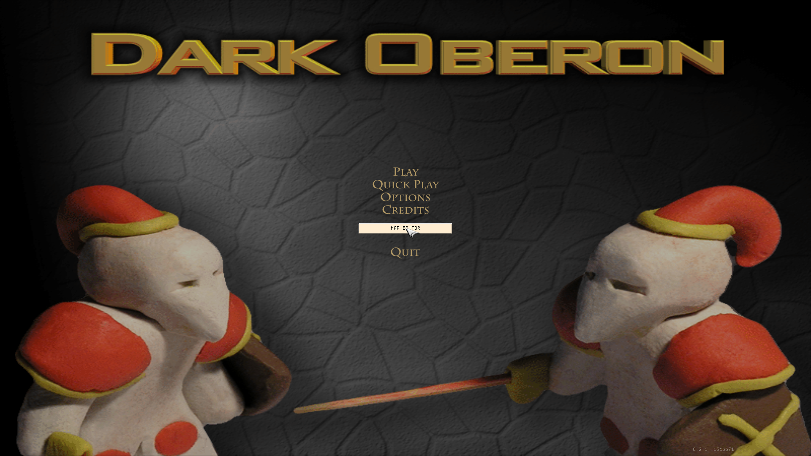
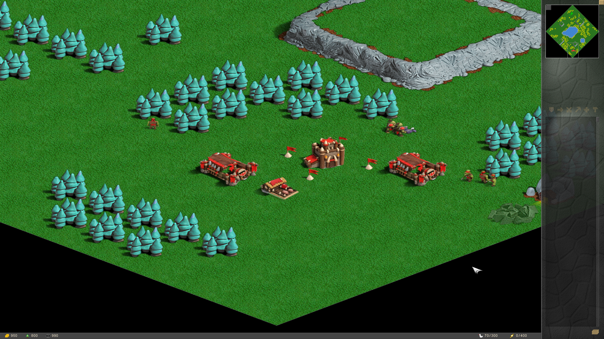
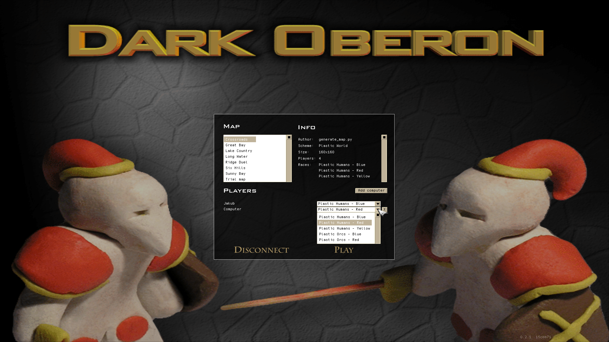
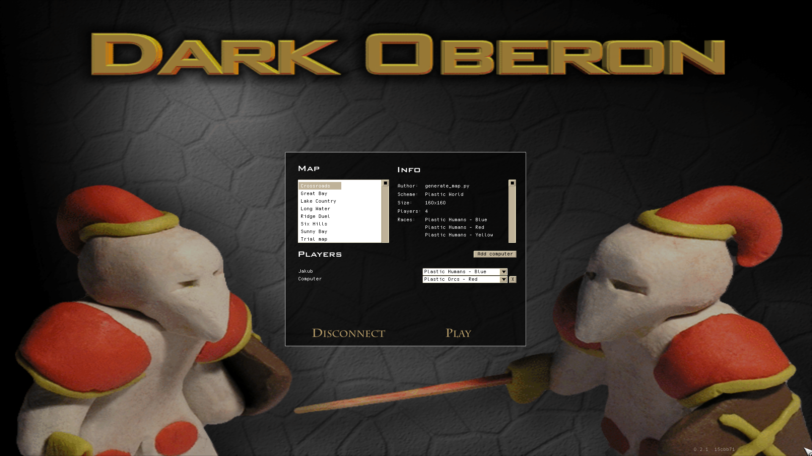
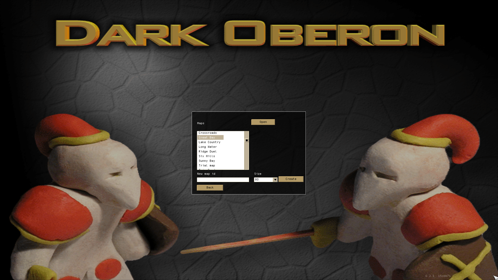
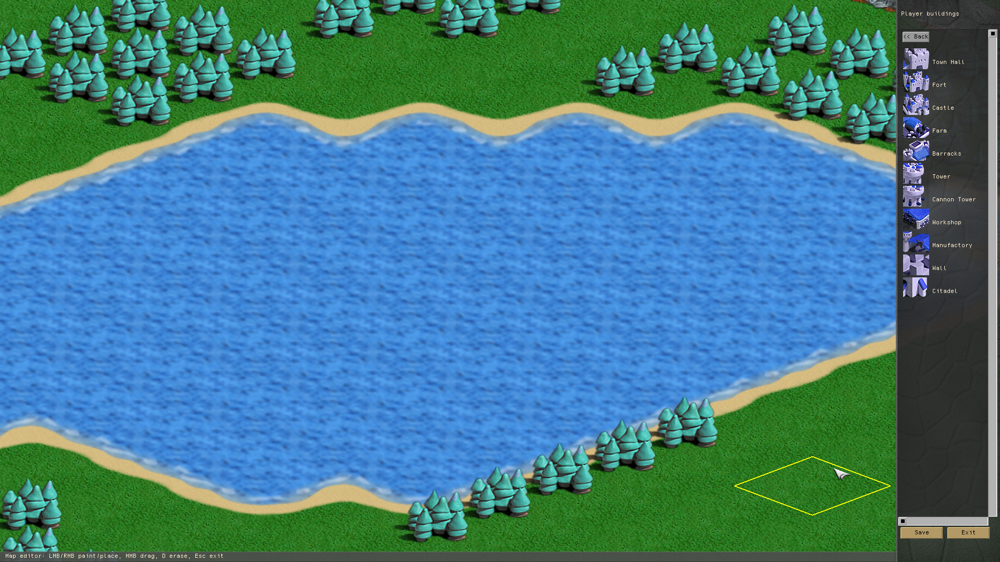
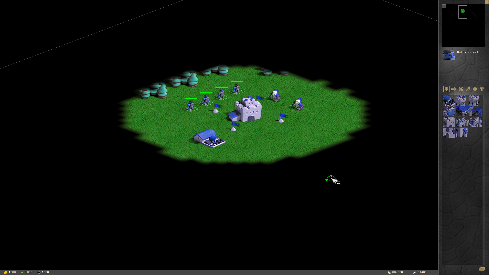
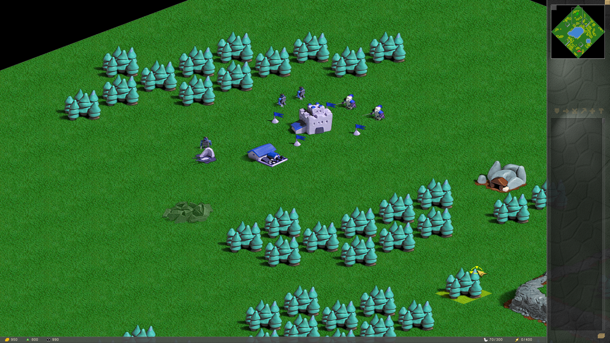
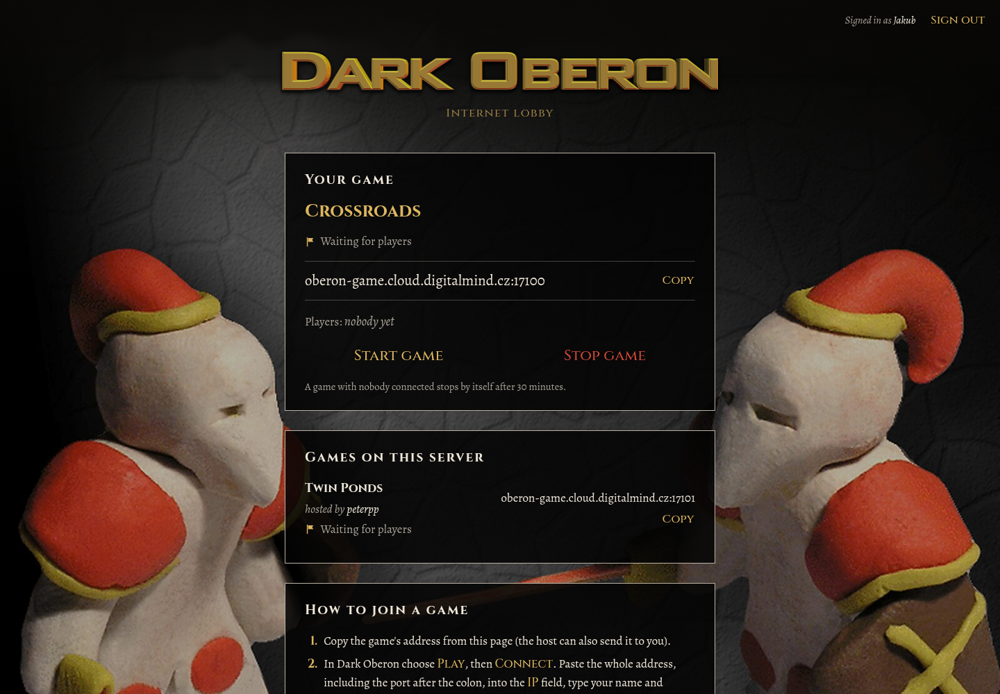

<p align="center">
  
</p>

<h1 align="center">Dark Oberon</h1>

<p align="center">
  <b>The plasticine real-time strategy from 2005, back on modern systems:<br>
  with orcs, CPU opponents, a map editor and internet play.</b>
</p>

<p align="center">
  
  
  
</p>

<p align="center">
  <a href="#linux"></a>
  <a href="#windows"></a>
  <a href="#haiku"></a>
</p>

---

Dark Oberon is an open-source RTS in the spirit of Warcraft II. Every unit and building was
**modelled in plasticine, photographed and turned into sprites**, and that handmade look is
what makes the game. The original was built for LAN multiplayer and had only an experimental
computer player. This fork lets you play properly against the computer, adds a second race and
a map editor, and runs internet games through a cloud lobby.

<p align="center">
  
</p>

## What's new in this fork

### Orcs: a whole new race

Humans now have an opponent. The **orc race** (`orc-red`, `orc-blue`, `orc-yellow`) matches the
human race one to one: 16 units and buildings, from the Peon and the Grunt to the Stronghold,
the Bone Catapult and the Goblin Zeppelin. The sprites were restyled from the originals so they keep the plasticine look, and
team colours are recoloured deterministically. The footman and the grunt also have a proper
4-frame sword attack now instead of one static frame.

<p align="center">
  
  <br><sub>An orc base run by a CPU player: the AI is already sending out its peons and grunts.</sub>
</p>

### CPU players who actually play

The original's computer player was only an experiment. Now you can add real **CPU players** to
any game, local or over the internet. Each one gets:

- **A level**: `easy`, `medium` or `hard`, which sets how fast it thinks and how much it does per
  turn (`ai_level` in `config.cfg`).
- **A random personality**: *aggressive*, *commercial*, *calm*, *rusher* or *turtle*, each with
  ±10 % noise. The rusher strikes early, the turtle builds towers and saves up for one big push,
  and the merchant focuses on the economy.
- **A military brain**: it gathers an army, attacks only when it has the upper hand, retreats when
  a fight is lost, defends in proportion to the threat, sends out scouts and remembers who attacked it.

The decision logic is a separate, tested module (`src/doai_logic.*`, `make test-ai`). The full
design is in [docs/AI_SYSTEM.md](docs/AI_SYSTEM.md).

<table>
  <tr>
    <td></td>
    <td></td>
  </tr>
  <tr>
    <td align="center"><sub>Click <b>Add computer</b> and pick its race and colour</sub></td>
    <td align="center"><sub>Humans vs orc CPU on the Crossroads map</sub></td>
  </tr>
</table>

### Map editor

The main menu has a **Map Editor**. You can open any map or start a blank one (80, 128 or
160 tiles), then paint terrain, place trees, rocks and mines, add players, set start positions
and place their starting buildings and units.

<table>
  <tr>
    <td></td>
    <td></td>
  </tr>
  <tr>
    <td align="center"><sub>Open an existing map or create a new one</sub></td>
    <td align="center"><sub>Terrain, objects and per-player buildings and units</sub></td>
  </tr>
</table>

### Seven new maps

A map generator (`.cursor/skills/dark-oberon-map/`) built balanced maps for 2, 4 and 6 players,
with closed coastlines, rocky plateaus with ramps and fair resources: **Twin Ponds, Ridge Duel,
Lake Country, Long Water, Crossroads, Great Bay** and **Six Hills**.

### Under the hood

- **SDL2 + OpenGL** instead of the long-dead GLFW 2 and FMOD. The game runs on **Linux, Windows and Haiku**.
- A **headless dedicated server** and a web **lobby** for internet games (see below).
- A **developer console**: press <kbd>`</kbd> in game and type `help`. It can reveal the map,
  add resources, speed up building and show AI logs.

<table>
  <tr>
    <td></td>
    <td></td>
  </tr>
  <tr>
    <td align="center"><sub>Your peasants and everything they can build</sub></td>
    <td align="center"><sub>A human town among the plasticine forests</sub></td>
  </tr>
</table>

## Play over the internet: Oberon Cloud

You don't need to set up a server or forward ports. Games run on the
**Oberon Cloud** at [digitalmind.cz](https://digitalmind.cz), and the lobby
at **<https://oberon.cloud.digitalmind.cz>** shows every game that's running.

<p align="center">
  
  <br><sub>The lobby: your game with its address, and the other games on the server.</sub>
</p>

**Hosting a game** needs a free account (just a name and a password, no e-mail):

1. **Create an account** in the lobby, or sign in.
2. **Create a game.** Pick a map and click **Create game**. The lobby shows the address to
   connect to, for example `oberon-game.cloud.digitalmind.cz:17001`. Each account can host one
   game at a time.
3. **Send that address to your friends.** They can also copy it from the list in the lobby.

**Joining a game** needs no account:

1. **Connect from the game:** choose **Play → Connect**, type the whole address including the
   port after the colon into the *IP* field, enter your name and confirm.
2. **Choose races.** In the game lobby each player picks a race and colour (every player needs a
   different one). Want more opponents? Click **Add computer** to fill free slots with CPU players.
3. **Start.** Click **Play** in the game. The host can also press **Start game** in the web lobby.

When you're done, the host clicks **Stop game** in the lobby. Games stop by themselves when
nobody has been connected for 30 minutes, and after 8 hours at most.

> Running your own server? `server/` has a ready-made Docker setup: the lobby web UI plus
> headless game servers in one container. Copy `server/.env.example` to `server/.env`, set
> `GAME_PUBLIC_HOST` and run `server/up-server`. Accounts are stored in the `lobby-data` Docker
> volume. Behind an HTTPS reverse proxy also set `TRUSTED_PROXIES=1` and `SESSION_COOKIE_SECURE=1`.

## Build and run

The game runs on **Linux**, **Windows** and **Haiku** (64-bit):

| | System | How to get it |
|---|---|---|
|  | any current distro | build from source with `make` |
|  | Windows 10 / 11 | unzip `dark-oberon-<version>-win64.zip`, run `dark-oberon.exe` |
|  | Haiku R1/beta6 | unzip `dark-oberon-<version>-haiku-x86_64.zip` after `pkgman install libsdl2 sdl2_mixer glu` |

### Linux

```bash
# Debian/Ubuntu: sudo apt install build-essential libsdl2-dev libgl1-mesa-dev libglu1-mesa-dev
# Arch/Manjaro:  sudo pacman -S base-devel sdl2 mesa glu
make               # the binary ./dark-oberon ends up in the repository root
./dark-oberon
```

- **Sound and music:** build with `make -C src SOUND=1` (needs SDL2_mixer).
- **Dedicated server:** `make -C src server`.
- **Tests:** `make test-ai` (C++ AI logic) and `python -m pytest tests/race_pipeline tests/mapgen tests/lobby`
  (the lobby tests need Flask: `pip install -r server/web/requirements.txt`).

Requirements are modest: any OpenGL-capable graphics card and SDL2.

### Windows

The Windows version is cross-compiled from Linux with MinGW-w64 into a ready-to-run zip:

```bash
sudo scripts/setup-windows-toolchain.sh   # once, Arch/Manjaro: mingw-w64-gcc, wine, zip
scripts/fetch-windows-deps.sh             # once: SDL2 + SDL2_mixer for Windows
make windows                              # -> dist/dark-oberon-<version>-win64.zip
```

Unzip it anywhere on Windows 10 or 11 and run `dark-oberon.exe`. Nothing else needs to be
installed: the SDL2 DLLs are in the zip and the C/C++ runtime is built into the exe. Settings
and logs are kept next to the exe (`config.cfg`, `logs/`). To try the build on Linux, run
`wine dark-oberon.exe` in the unpacked folder.

### Haiku

Haiku builds natively with the same Makefile as Linux:

```bash
pkgman install libsdl2_devel sdl2_mixer_devel glu_devel
make -C src SOUND=1   # the binary ./dark-oberon ends up in the repository root
./dark-oberon
```

Settings and logs go to `~/.dark-oberon/`.

A ready-to-run zip can be built from Linux with `make haiku`, which compiles the game on a Haiku
machine over SSH (`HAIKU_HOST`, default `haiku`) and saves `dist/dark-oberon-<version>-haiku-x86_64.zip`.
To play from that zip you only need the runtime libraries: `pkgman install libsdl2 sdl2_mixer glu`.

## Documentation

- [User documentation](docs/User_documentation_EN.md): how to play, controls, `config.cfg`
- [Quick guide](docs/Quick_Guide_EN.txt)
- [Programmer documentation](docs/Programmer_documentation_EN.md) and
  [project documentation](docs/Project_documentation_EN.md)
- [AI system](docs/AI_SYSTEM.md), [race format spec](docs/RACE_SPEC_FOR_AI.md)
- [CHANGELOG](CHANGELOG.md): what changed in each version

## Thanks to the original authors ❤️

None of this would exist without the people who created Dark Oberon between **2002 and 2005**
as a student project (course PRG023 – Project, supervised by RNDr. Jakub Yaghob) at the Faculty
of Mathematics and Physics, Charles University in Prague.
They modelled every peasant, knight and castle in plasticine, photographed them frame by frame,
wrote the engine, the network code and the data formats, and released it all under the GPL.
This fork stands on their work. **Thank you!**

| | Original author | |
|---|---|---|
| **crazych** | Jiří Krejsa | crazych@matfyz.cz |
| **index** | Michal Král | index@matfyz.cz |
| **jojolaser** | Marián Černý | jojo@matfyz.cz |
| **libertik** | Valéria Šventová | liberty@matfyz.cz |
| **martinpp** | Martin Košalko | cauchy@matfyz.cz |
| **peterpp** | Peter Knut | peterpp@matfyz.cz |

Music by **lealoo** ([www.lealoo.cz](http://www.lealoo.cz)).
Original homepage: <http://dark-oberon.sourceforge.net/>

This fork is maintained by [digitalmind.cz](https://digitalmind.cz).

## License

Dark Oberon is free software under the **GNU General Public License, version 2 or (at your option)
any later version**. Copyright © 2002–2005 Valéria Šventová, Jiří Krejsa, Peter Knut, Martin Košalko,
Marián Černý, Michal Král, and the fork contributors.
