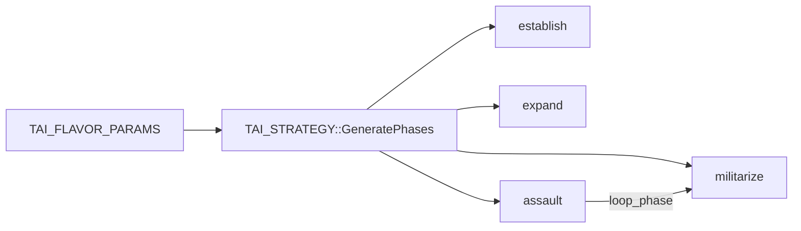
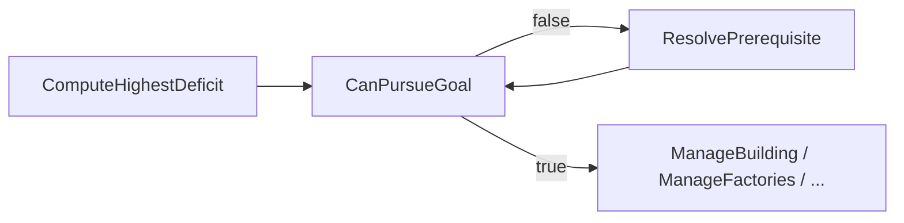

# Dark Oberon — Computer player AI

This document describes the gameplay-oriented “artificial opponent” layer added in 1.0.2-RC1: architecture, how to run CPU players, and how to extend behavior.

**Maintainers:** When you change CPU AI logic in [`src/doai.cpp`](../src/doai.cpp) / [`src/doai.h`](../src/doai.h) (deficit ordering, food, factory gates, trace text, console `logs` commands), update this document in the **same** commit or PR so it stays accurate.

## Overview

- **CPU slots** are marked in the lobby (`TPLAYER_ARRAY::IsComputer`). At runtime, `CreatePlayers()` allocates **`TAI_PLAYER`** instead of **`TPLAYER`** for those slots.
- The AI issues the **same commands** as a human: `StartMine`, `StartBuild`, `AddUnitToOrder`, `StartAttacking`, etc. No special simulation bypass.
- **Two axes** define behavior:
  - **Level** — competence: think interval, actions per tick, build multitasking (`TAI_LEVEL_EASY`, `_MEDIUM`, `_HARD`).
  - **Strategy flavor params** — economy vs military vs defense via **`TAI_FLAVOR_PARAMS`** (`FLAVOR_AGGRESSIVE`, `FLAVOR_COMMERCIAL`, `FLAVOR_CALM`), which feed **`TAI_STRATEGY`** phase targets.
- Default build today: **Easy + Aggressive** (see `TAI_PLAYER` constructor in [`src/doai.cpp`](../src/doai.cpp)).

## Architecture

| Component | Role |
|-----------|------|
| `TAI_PLAYER` | Subclass of `TPLAYER`; owns `TAI_CONTROLLER` + level/strategy instances; implements `UpdateAI()`. |
| `TAI_CONTROLLER` | Throttled `Think(dt)` loop: scan state, anti-stall, workers, building, factories, combat, scouting, phase progression. |
| `TAI_GAME_STATE` | Snapshot from `TPLAYER::units` (counts, idle lists, materials, sources, unload capability, energy, food in/out, defense building count, `any_factory_blocked_on_food`). |
| `TAI_LEVEL` | Virtual API: `GetThinkInterval()`, `GetMaxActionsPerTick()`, etc. |
| `TAI_FLAVOR_PARAMS` | Three floats: `aggressivity`, `defense_priority`, `econ_focus` (0–1). |
| `TAI_STRATEGY` | Builds a fixed sequence of **`TAI_PHASE`** entries from those params; each phase has **`TAI_PHASE_TARGETS`** (min workers/forces/factories/buildings/defense, `scout_ratio`, `attack_when_ready`, `build_farms`). |
| `ComputeHighestDeficit` | Maps current state + phase targets to the next **`TAI_BUILD_GOAL`** (then gated by `CanPursueGoal` / `ResolvePrerequisite`). See [Deficit order and food](#deficit-order-and-food) below. |

### Parametric phases (high level)



- **First visible enemy** sets `enemy_contacted` and bumps **`current_phase`** to at least **`GetCombatPhase()`** (militarize or assault depending on aggressivity).
- When the current phase’s **`IsSatisfied()`** is true, the controller advances to the next phase, or jumps to **`GetLoopPhase()`** after the last phase (typically back to **militarize** for sustained production + pressure).

### Simulation thread

`UpdateAI()` is called from **`ProcessFunction`** in [`src/doengine.cpp`](../src/doengine.cpp) **after** the event queue is drained for the frame, **only** if:

- `player_array.IsComputer(i)` and
- `!player_array.IsRemote(i)` (authority on **leader / host**).

Followers do **not** run AI; they replay `net_protocol_event` for CPU players like any remote peer.

### Multiplayer and dedicated server

- **Leader (GUI host)** or **`dark-oberon-server`**: CPU players are local → AI runs here → events broadcast to clients.
- **Clients**: CPU players are remote → no `UpdateAI()` on that machine.

## Adding CPU players

### Single-player / quick play

Existing flow still calls `player_array.AddComputerPlayer()` (e.g. quick play with two races).

### Network lobby (leader)

- Button **“Add computer”** on the game setup panel (`MNU_ADD_COMPUTER`).
- Picks an **unused** race from the current map’s `rac_list` so `EveryPlayerHasDifferentRace()` can still pass.

### Dedicated server CLI

After launch, type:

```text
addcpu
```

Same race assignment logic as the GUI (unused race from map list). See `RunDedicatedServer()` in `doengine.cpp`.

**AI debug (`logs`):** in the **in-game dev console** (grave / `` ` `` key) type `help` — includes `logs` — or use the dedicated server stdin:

| Command | Effect |
|---------|--------|
| `logs` | Lists CPU player slots and names. |
| `logs <slot>` | Dumps that CPU’s phase, strategy targets, deficit goal, scanned state, and **time until the next AI think** (`think_interval − accumulator`). Requires a running game (`start`) so `players[slot]` exists. |
| `logs enable` or `logs on` | Prints to stderr when any CPU **changes phase** after a think tick: `Player <id> (<name>) reached new phase <n> "<name>"`. |
| `logs off` | Disables phase transition lines. |
| `logs think on` | Per-think-tick **stderr** trace for all CPUs: deficit, mining, `ManageFactories`, food/energy/material blockers, `HandleResourceShortage`, etc. (`[ai trace]` lines). |
| `logs think off` | Disables per-tick AI trace. |

**How often can the phase change?** At most **once per AI think tick** for a given player. The tick runs only while the match is simulating, on the interval from **`TAI_LEVEL`** (default Easy ≈ 3 s, Medium ≈ 1.5 s, Hard ≈ 0.5 s). A new phase is taken when `TAI_PHASE::IsSatisfied()` is true at the **end** of that tick (or when **first enemy sighting** bumps `current_phase` to `combat_phase`).

## Level × flavor matrix (design)

| Level | Think interval (default) | Actions / tick | Notes |
|-------|----------------------------|----------------|--------|
| Easy | ~3 s | 1 | Slow reactions, single build/order focus. |
| Medium | ~1.5 s | 3 | Stronger multitasking. |
| Hard | ~0.5 s | 16 | High throughput. |

| Preset | `aggressivity` | `defense_priority` | `econ_focus` | Typical behavior |
|--------|----------------|-------------------|---------------|------------------|
| `FLAVOR_AGGRESSIVE` | 0.9 | 0.2 | 0.3 | Larger army targets, higher `scout_ratio`, attacks in assault phase when `attack_when_ready`. |
| `FLAVOR_COMMERCIAL` | 0.2 | 0.6 | 0.9 | More workers, farms when `econ_focus > 0.5`, more defense buildings; **no** attack in assault (`aggressivity <= 0.3`). |
| `FLAVOR_CALM` | 0.5 | 0.5 | 0.5 | Middle ground on all targets. |

Any **Level × preset** pair is valid (e.g. Hard + Commercial = efficient turtle). To try another preset, change `TAI_PLAYER` to construct `TAI_STRATEGY(FLAVOR_COMMERCIAL)` (or pass a custom `TAI_FLAVOR_PARAMS`).

## Gameplay prerequisites (logical dependencies)

The manual ([`User_documentation_SK.md`](User_documentation_SK.md), mining / production) states that after mining, a worker goes to the **nearest building that accepts that material**; without such a building, the worker stalls at the source. Factories need **stored materials** and sufficient **player energy** (`min_energy` in `.rac`); production pauses if energy drops too low.

The AI separates **strategic intent** from **whether an action is valid now**:

1. **`ComputeHighestDeficit(state, phase.targets)`** — what the current phase still needs (`BG_FACTORY`, `BG_FORCE`, …). Log line **`deficit_raw`** is this value; **`deficit`** (diagnostics / trace) is the same after up to 8 **`ResolvePrerequisite`** steps when **`CanPursueGoal`** was false.
2. **`TAI_CONTROLLER::CanPursueGoal(goal, state)`** — whether that goal is actionable given the scanned world.
3. **`TAI_CONTROLLER::ResolvePrerequisite(goal, state)`** — one step toward a satisfiable goal (e.g. need a drop-off before mining or building a costly factory).

### Deficit order and food

**`TAI_BUILD_GOAL` (subset):** `BG_NONE`, `BG_WORKER`, `BG_FORCE` (train **military** units from factories — not a building blueprint), `BG_FARM`, `BG_RESOURCE_BLDG`, `BG_FACTORY`, `BG_DEFENSE`, `BG_UPGRADE`.

**`ComputeHighestDeficit` priority** (first match wins; see [`src/doai.cpp`](../src/doai.cpp)):

1. Drop-off / unload building if phase requires buildings and none accept materials.
2. First **military** factory (`BG_FACTORY`) when phase needs factories but only town hall exists, etc.
3. Factory count below `min_factories`.
4. Workers below `min_workers` → `BG_WORKER`.
5. Extra military factories up to `target_military_factories` → `BG_FACTORY`.
6. **`BG_FARM`** if `build_farms` and **either** global food drain (`food_out > 0` and `food_in < food_out`) **or** any completed factory has a queued order and **`GetNeedID() == 0`** (engine: not enough food for the **first payment** of the current product — can happen even when `food_in >= food_out`). Flag: **`any_factory_blocked_on_food`** in **`TAI_GAME_STATE`**.
7. Army below `min_forces` → **`BG_FORCE`** (needs finished military factory).
8. Army below **`train_to_forces`** cap → **`BG_FORCE`** (assault keeps training past minimums).
9. Defense buildings, then `BG_NONE`.

So **`BG_FORCE` in logs does not mean “food is fine”** — step 6 deliberately runs **before** steps 7–8 so the AI builds farms when production is food-starved instead of spinning on `ManageFactories(..., BG_FORCE)` with `placed=0`.

**`Think()` note:** `ManageBuilding` is **not** called for `BG_WORKER` or `BG_FORCE` in the main build slot; workers come from **`ManageFactories`**, military training likewise. Farms use **`ManageBuilding(BG_FARM)`** when the effective deficit is `BG_FARM` (or early in **`HandleResourceShortage`**).



| Game rule (summary) | `TAI_GAME_STATE` / check | `CanPursueGoal` | Typical fallback via `ResolvePrerequisite` |
|---------------------|--------------------------|-----------------|---------------------------------------------|
| Need a **completed** building that **accepts** each mined material | `can_unload_material[]`, `has_any_unload_building` (from `IT_BUILDING` + completed `IT_FACTORY` with `AllowAnyMaterial`) | `BG_FACTORY`, `BG_FORCE`, `BG_DEFENSE` require `has_any_unload_building` | `BG_RESOURCE_BLDG` |
| **Military production** needs a **finished** military factory | `has_military_factory` only if factory not `US_IS_BEING_BUILT` | `BG_FORCE` needs factory + unload | `BG_FACTORY` then possibly `BG_RESOURCE_BLDG` |
| **Factory orders** need energy headroom | `energy_in`, `energy_out` → `energy_sufficient` | N/A (gated in `ManageFactories`) | — |
| **Factory production** food (per-unit start) | `any_factory_blocked_on_food` (scan: factory with `GetOrderSize() > 0` and `GetNeedID() == 0`) | — | Raises **`BG_FARM`** (if `build_farms`) before `BG_FORCE`; **`HandleResourceShortage`** also tries a farm |
| **Queue worker** from factory | `idle_factories_len` | `BG_WORKER` | `BG_FACTORY` |

**Data-driven content:** concrete building `id` values (town hall, shed, …) come from `.rac`; the AI uses each worker’s **`build_list`** and `MatchesGoal`, not hardcoded names. If no worker can build a drop-off (e.g. race design), prerequisite resolution cannot fix that — same as for a human.

## Anti-stall behavior

`HandleResourceShortage()` runs at the **start** of each AI think tick (after the first `ScanFromPlayer`). It:

- Tries **`ManageBuilding(BG_FARM)`** when **either** global food runs short (`food_out > 0` and `food_in < food_out`) **or** **`any_factory_blocked_on_food`** is set (factories stuck on food for the next unit’s first payment — same condition as production code in [`src/dofactories.cpp`](../src/dofactories.cpp)). With **`logs think on`**, the line includes `net=y|n` and `factory_need_food=y|n`.
- If **`worker_count < 2`** and **`energy_sufficient`**, queues a **worker** from the first idle factory that can produce `IT_WORKER`.

**Mining** (idle workers → sources) is **`AssignIdleWorkers`** later in the same tick, not inside `HandleResourceShortage`. It only uses materials that have both **`has_source`** and **`can_unload_material`**.

Terrain, visibility, and `can_build` per worker type still depend on map/race data.

## Extending the AI

1. **New level** — Subclass `TAI_LEVEL`, override timing/action limits; construct it in `TAI_PLAYER` (or add config later).
2. **New personality** — Add a `TAI_FLAVOR_PARAMS` constant (or load from config) and pass it to `TAI_STRATEGY`. Adjust **`GeneratePhases()`** if you need extra phases or different formulas. Add or adjust **`CanPursueGoal` / `ResolvePrerequisite`** if new `TAI_BUILD_GOAL` values need global prerequisites.
3. **Smarter building** — Improve `FindBuildPosition()` (spiral from `initial_x`/`initial_y`), add `BG_UPGRADE` handling using `ancestor` + `IsPositionAvailable(..., test_ancestor=true)`.
4. **Scouting** — `phase.targets.scout_ratio` scales how many idle combat units get exploratory `StartMoving` orders per tick (`ManageScouting`); visibility APIs: `FindVisibleEnemyForPlayer` in `doai.cpp`.

## Related docs

- Race / `.rac` format for content authors: [`RACE_SPEC_FOR_AI.md`](RACE_SPEC_FOR_AI.md).

## Source files

- [`src/doai.h`](../src/doai.h) — Declarations.
- [`src/doai.cpp`](../src/doai.cpp) — Implementation.
- [`src/doplayers.cpp`](../src/doplayers.cpp) — `CreatePlayers()` selects `TAI_PLAYER` for computer slots.
- [`src/doplayers.h`](../src/doplayers.h) — `TPLAYER::UpdateAI()` virtual hook.
- [`src/doengine.cpp`](../src/doengine.cpp) — `ProcessFunction` AI tick, lobby `MNU_ADD_COMPUTER`, headless `addcpu`.
