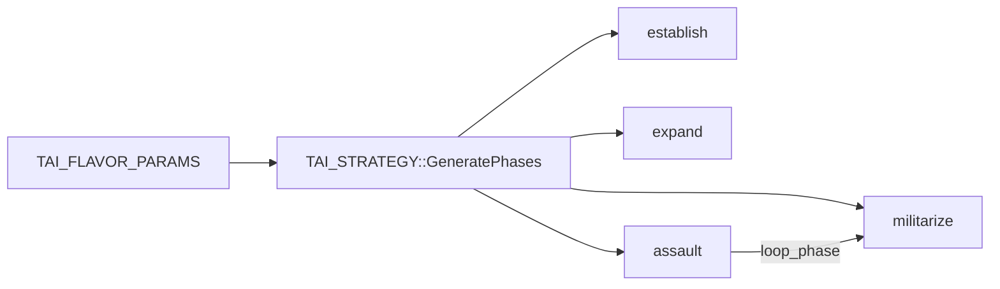
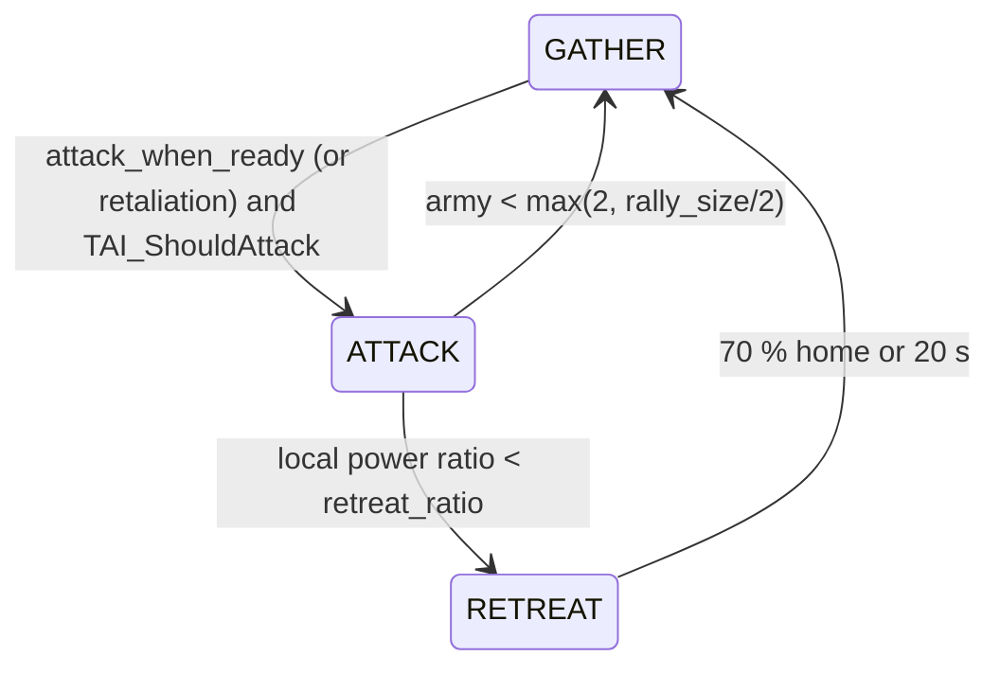
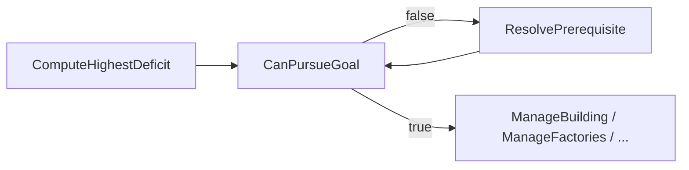

# Dark Oberon — Computer player AI

This document describes the gameplay-oriented “artificial opponent” layer added in 1.0.2-RC1: architecture, how to run CPU players, and how to extend behavior.

**Maintainers:** When you change CPU AI logic in [`src/doai.cpp`](../src/doai.cpp) / [`src/doai.h`](../src/doai.h) (deficit ordering, food, factory gates, trace text, console `logs` commands), update this document in the **same** commit or PR so it stays accurate.

## Overview

- **CPU slots** are marked in the lobby (`TPLAYER_ARRAY::IsComputer`). At runtime, `CreatePlayers()` allocates **`TAI_PLAYER`** instead of **`TPLAYER`** for those slots.
- The AI issues the **same commands** as a human: `StartMine`, `StartBuild`, `AddUnitToOrder`, `StartAttacking`, etc. No special simulation bypass.
- **Two axes** define behavior:
  - **Level** — competence: think interval, actions per tick, build multitasking (`TAI_LEVEL_EASY`, `_MEDIUM`, `_HARD`).
  - **Personality** — **`TAI_PERSONALITY`** (economy flavor **`TAI_FLAVOR_PARAMS`** + military temperament), rolled randomly per CPU from five presets with ±10 % noise. The flavor feeds **`TAI_STRATEGY`** phase targets; the temperament drives the military state machine.
- **Level** comes from `ai_level` in `config.cfg` (`easy|medium|hard`, default `medium`) or from `addcpu <level>` on the dedicated server. Both are chosen lazily on the first AI tick (`TAI_PLAYER::EnsureController`, the slot id is set after construction) and logged: `CPU player <slot>: level=… personality=…`.
- **Randomness** uses the AI's own PCG32 generator (**`TAI_RNG`**), never the global `rand()` that the simulation relies on. The AI runs only where the slot is local (leader), so AI randomness cannot desync followers.

## Architecture

| Component | Role |
|-----------|------|
| `TAI_PLAYER` | Subclass of `TPLAYER`; owns `TAI_CONTROLLER` + level/strategy instances; implements `UpdateAI()`. |
| `TAI_CONTROLLER` | Throttled `Think(dt)` loop: scan state, anti-stall, workers, building, factories, combat, scouting, phase progression. |
| `TAI_GAME_STATE` | Snapshot from `TPLAYER::units` (counts, idle lists, materials, sources, unload capability, energy, food in/out, defense building count, `any_factory_blocked_on_food`). |
| `TAI_LEVEL` | Virtual API: `GetThinkInterval()`, `GetMaxActionsPerTick()`, etc. |
| `TAI_FLAVOR_PARAMS` | Three floats: `aggressivity`, `defense_priority`, `econ_focus` (0–1). |
| `TAI_PERSONALITY` | Flavor + `attack_ratio`, `retreat_ratio`, `rally_size`, `defense_commit`, `scout_count` ([`src/doai_logic.h`](../src/doai_logic.h)). |
| `doai_logic.{h,cpp}` | Engine-independent decisions (RNG, personalities, army power, attack/retreat/defense, target score, retaliation expiry, order de-dup). Unit tests: `make test-ai` ([`tests/cpp/test_ai_logic.cpp`](../tests/cpp/test_ai_logic.cpp)). |
| `TAI_STRATEGY` | Builds a fixed sequence of **`TAI_PHASE`** entries from those params; each phase has **`TAI_PHASE_TARGETS`** (min workers/forces/factories/buildings/defense, `scout_ratio`, `attack_when_ready`, `build_farms`). |
| `ComputeHighestDeficit` | Maps current state + phase targets to the next **`TAI_BUILD_GOAL`** (then gated by `CanPursueGoal` / `ResolvePrerequisite`). See [Deficit order and food](#deficit-order-and-food) below. |

### Parametric phases (high level)



- **First visible enemy** sets `enemy_contacted` and bumps **`current_phase`** to at least **`GetCombatPhase()`** (militarize or assault depending on aggressivity).
- When the current phase’s **`IsSatisfied()`** is true, the controller advances to the next phase, or jumps to **`GetLoopPhase()`** after the last phase (typically back to **militarize** for sustained production + pressure).

### Simulation thread

`UpdateAI()` is called from **`ProcessFunction`** in [`src/doengine.cpp`](../src/doengine.cpp) **after** the event queue is drained for the frame, **only** if:

- `player_array.IsComputer(i)` and
- `!player_array.IsRemote(i)` — the process that **owns** the slot locally runs AI (in today’s setup, CPU slots are always added on the **leader**, so that is the host GUI or the headless dedicated process).

Followers do **not** run AI for those slots; they receive the same simulation via `net_protocol_event` like for any other remote-owned player.

### Multiplayer and dedicated server

- **Lobby sync:** The leader rebroadcasts the full player list (including the CPU flag per slot) with `TLEADER::SendPlayerArray()` in [`src/doleader.cpp`](../src/doleader.cpp). Followers rebuild `player_array` in `ProcessPlayerArray()` in [`src/doengine.cpp`](../src/doengine.cpp). After leader-side changes, `UpdatePlayersAndMenu()` triggers that send so all peers stay consistent.
- **Desync risk:** Every client must apply the **same** roster, races, and start points from the leader. Followers must not fake a CPU slot locally — use **Add computer** in the lobby (sends `net_protocol_request_add_computer` to the leader, who applies it and rebroadcasts), the leader’s own button, or `addcpu` on a headless dedicated server.
- **Leader (GUI host)** or **`dark-oberon-server`**: CPU players are local (`!IsRemote`) → `UpdateAI()` runs here → commands become events like a human.
- **Follower clients**: CPU slots are remote → no `UpdateAI()` on that machine.

## Adding CPU players

### Single-player / quick play

Existing flow still calls `player_array.AddComputerPlayer()` (e.g. quick play with two races).

### Network lobby (leader or follower)

- Button **“Add computer”** on the game setup panel (`MNU_ADD_COMPUTER`). **Leader:** adds the slot locally and calls `UpdatePlayersAndMenu()` → `SendPlayerArray`. **Follower:** sends `TFOLLOWER::SendRequestAddComputer()` (`net_protocol_request_add_computer`); the leader performs the same add and rebroadcasts.
- Picks an **unused** race from the current map’s `rac_list` so `EveryPlayerHasDifferentRace()` can still pass.

### Dedicated server CLI

After launch, type:

```text
addcpu            # level from config.cfg ai_level (default medium)
addcpu hard       # easy | medium | hard for this slot only (leader-local, not synced)
```

Same race assignment logic as the GUI (unused race from map list). See `RunDedicatedServer()` in `doengine.cpp`.

**AI debug (`logs`):** in the **in-game dev console** (grave / `` ` `` key) type `help` — includes `logs` — or use the dedicated server stdin:

| Command | Effect |
|---------|--------|
| `logs` | Lists CPU player slots and names. |
| `logs <slot>` | Dumps that CPU’s phase, strategy targets, deficit goal, scanned state, and **time until the next AI think** (`think_interval − accumulator`). Requires a running game (`start`) so `players[slot]` exists. |
| `logs enable` or `logs on` | Prints to stderr when any CPU **changes phase** after a think tick: `Player <id> (<name>) reached new phase <n> "<name>"`. |
| `logs off` | Disables phase transition lines. |
| `logs think on` | Per-think-tick **stderr** trace for all CPUs: deficit, mining, `ManageFactories`, food/energy/material blockers, `HandleResourceShortage`, etc. (`[ai trace]` lines). |
| `logs think off` | Disables per-tick AI trace. |

**How often can the phase change?** At most **once per AI think tick** for a given player. The tick runs only while the match is simulating, on the interval from **`TAI_LEVEL`** (default Easy ≈ 3 s, Medium ≈ 1.5 s, Hard ≈ 0.5 s). A new phase is taken when `TAI_PHASE::IsSatisfied()` is true at the **end** of that tick (or when **first enemy sighting** bumps `current_phase` to `combat_phase`).

## Military behaviour

Every think tick the controller scans the map **once** (`ScanEnemies`: visible enemy units, their power, which are near our structures, who is hitting us), then:

1. **Scouting** (`ManageScouting`) — `round(scout_count)` (1–2) dedicated scouts, only when the army has at least `scouts + 2` units; the lightest combat units are recruited. An idle scout gets a new random target: half the time near an enemy start, otherwise a random map point. Scouts are excluded from defense and the field army.
2. **Defense** (`ManageDefense`) — enemies within 12 tiles of our structures that are military or attacking us are threats. The best-scored threat is attacked by the nearest units until their power ≥ `defense_commit × threat power` (`TAI_DefenseCommitCount`); the rest of the army is not pulled back.
3. **Field army** (`ManageArmy`) — state machine:



- **Rally point**: 8 tiles from our base toward the chosen enemy (`TAI_RallyPoint`); idle units away from it are grouped there.
- **Attack** needs `rally_size` units and `my_power / enemy_estimate ≥ attack_ratio`; with no enemy seen yet, 1.5 × `rally_size` units. Enemy estimate = max(visible power, remembered power halved every 60 s).
- **Targets** (`TAI_TargetScore`): units attacking us > combat units > armed structures > other structures; closer and wounded preferred, searched within 20 tiles of the army centroid, otherwise march on the enemy start.
- **Army power** = (Σ gun power) × (Σ life) of the units (Lanchester estimate from `.rac` data).
- **Retaliation**: whoever hits us becomes the target for 90 s after the last hit (`TAI_RETALIATION`), then the AI returns to the nearest enemy.
- **Orders** are de-duplicated (`TAI_ORDER_MEMO`) and use one group path per order (no per-unit `StartMoving` on top of it).
- `logs on` prints transitions: `Player <id> (<name>) military GATHER -> ATTACK (my=… enemy=… n=… t=…s)`.

**Variability** besides personalities: `FindBuildPosition` walks the spiral in a random orientation and picks randomly among the first valid sites (margins and lanes are still respected); factories pick military products by weighted random choice (weight = (score / best)^(0.5 + aggressivity)), the heavy-unit quota still applies.

## Level × personality

| Level | Think interval (default) | Actions / tick | Notes |
|-------|----------------------------|----------------|--------|
| Easy | ~3 s | 1 | Slow reactions, single build/order focus. |
| Medium | ~1.5 s | 3 | Stronger multitasking. |
| Hard | ~0.5 s | 16 | High throughput. |

| Preset | `aggressivity` | `defense_priority` | `econ_focus` | Typical behavior |
|--------|----------------|-------------------|---------------|------------------|
| Preset | agg | def | eco | attack_ratio | retreat_ratio | rally | defense_commit | scouts | Notes |
|--------|-----|-----|-----|--------------|---------------|-------|----------------|--------|-------|
| `aggressive` | 0.90 | 0.20 | 0.30 | 1.15 | 0.60 | 6 | 1.3 | 1.5 | attacks in assault |
| `commercial` | 0.20 | 0.60 | 0.90 | 1.80 | 0.90 | 10 | 1.8 | 1 | economy, defense; attacks only when retaliating (`attack_when_ready` needs aggressivity > 0.3) |
| `calm` | 0.50 | 0.50 | 0.50 | 1.40 | 0.75 | 8 | 1.5 | 1 | middle ground |
| `rusher` | 1.00 | 0.05 | 0.25 | 1.00 | 0.50 | 4 | 1.2 | 2 | attacks already in militarize (`TAI_STRATEGY(..., rush=true)`) |
| `turtle` | 0.40 | 0.95 | 0.60 | 2.00 | 1.00 | 14 | 2.0 | 1 | many towers, late big push |

`TAI_RollPersonality` multiplies each value by a random factor 0.9–1.1 (flavor clamped to 0–1, `retreat_ratio` ≤ 0.9 × `attack_ratio`, `rally_size` ±1, min 2). `logs <slot>` prints the rolled values (`AI: level=… personality=…`) and the military state (`Military: state=…`).

## Gameplay prerequisites (logical dependencies)

The manual ([`User_documentation_SK.md`](User_documentation_SK.md), mining / production) states that after mining, a worker goes to the **nearest building that accepts that material**; without such a building, the worker stalls at the source. Factories need **stored materials** and sufficient **player energy** (`min_energy` in `.rac`); production pauses if energy drops too low.

The AI separates **strategic intent** from **whether an action is valid now**:

1. **`ComputeHighestDeficit(state, phase.targets)`** — what the current phase still needs (`BG_FACTORY`, `BG_FORCE`, …). Log line **`deficit_raw`** is this value; **`deficit`** (diagnostics / trace) is the same after up to 8 **`ResolvePrerequisite`** steps when **`CanPursueGoal`** was false.
2. **`TAI_CONTROLLER::CanPursueGoal(goal, state)`** — whether that goal is actionable given the scanned world.
3. **`TAI_CONTROLLER::ResolvePrerequisite(goal, state)`** — one step toward a satisfiable goal (e.g. need a drop-off before mining or building a costly factory).

### Deficit order and food

**`TAI_BUILD_GOAL` (subset):** `BG_NONE`, `BG_WORKER`, `BG_FORCE` (train **military** units from factories — not a building blueprint), `BG_FARM`, `BG_RESOURCE_BLDG`, `BG_FACTORY`, `BG_DEFENSE`, `BG_UPGRADE`, `BG_ENERGY` (building with `energy > 0`; plastic: farm).

**`ComputeHighestDeficit` priority** (first match wins; see [`src/doai.cpp`](../src/doai.cpp)):

1. Drop-off / unload building if phase requires buildings and none accept materials.
2. First **military** factory (`BG_FACTORY`) when phase needs factories but only town hall exists, etc.
3. Factory count below `min_factories`.
4. Workers below `min_workers` → `BG_WORKER`.
5. Extra military factories up to `target_military_factories` → `BG_FACTORY`.
6. **`BG_FARM`** if `build_farms` and **either** global food drain (`food_out > 0` and `food_in < food_out`) **or** any completed factory has a queued order and **`GetNeedID() == 0`** (engine: not enough food for the **first payment** of the current product — can happen even when `food_in >= food_out`). Flag: **`any_factory_blocked_on_food`** in **`TAI_GAME_STATE`**.
6b. **`BG_ENERGY`** when consumers drain more energy than is produced (`energy_out > energy_in`) — barracks/workshops stall below their `min_energy` otherwise.
7. Army below `min_forces` → **`BG_FORCE`** (needs finished military factory).
8. Army below **`train_to_forces`** cap → **`BG_FORCE`** (assault keeps training past minimums).
9. Defense buildings, then `BG_NONE`.

So **`BG_FORCE` in logs does not mean “food is fine”** — step 6 deliberately runs **before** steps 7–8 so the AI builds farms when production is food-starved instead of spinning on `ManageFactories(..., BG_FORCE)` with `placed=0`.

**`Think()` note:** `ManageBuilding` is **not** called for `BG_WORKER` or `BG_FORCE` in the main build slot; workers come from **`ManageFactories`**, military training likewise. Farms use **`ManageBuilding(BG_FARM)`** when the effective deficit is `BG_FARM` (or early in **`HandleResourceShortage`**).



| Game rule (summary) | `TAI_GAME_STATE` / check | `CanPursueGoal` | Typical fallback via `ResolvePrerequisite` |
|---------------------|--------------------------|-----------------|---------------------------------------------|
| Need a **completed** building that **accepts** each mined material | `can_unload_material[]`, `has_any_unload_building` (from `IT_BUILDING` + completed `IT_FACTORY` with `AllowAnyMaterial`) | `BG_FACTORY`, `BG_FORCE`, `BG_DEFENSE` require `has_any_unload_building` | `BG_RESOURCE_BLDG` |
| **Military production** needs a **finished** military factory | `has_military_factory` only if factory not `US_IS_BEING_BUILT` | `BG_FORCE` needs factory + unload | `BG_FACTORY` then possibly `BG_RESOURCE_BLDG` |
| **Factory orders** need energy headroom | `energy_in`, `energy_out` → `energy_sufficient` | N/A (gated in `ManageFactories`) | — |
| **Factory production** food (per-unit start) | `any_factory_blocked_on_food` (scan: factory with `GetOrderSize() > 0` and `GetNeedID() == 0`) | — | Raises **`BG_FARM`** (if `build_farms`) before `BG_FORCE`; **`HandleResourceShortage`** also tries a farm |
| **Queue worker** from factory | `idle_factories_len` | `BG_WORKER` | `BG_FACTORY` |

**Data-driven content:** concrete building `id` values (town hall, shed, …) come from `.rac`; the AI uses each worker’s **`build_list`** and `MatchesGoal`, not hardcoded names. If no worker can build a drop-off (e.g. race design), prerequisite resolution cannot fix that — same as for a human.

## Anti-stall behavior

`HandleResourceShortage()` runs at the **start** of each AI think tick (after the first `ScanFromPlayer`). It:

- Tries **`ManageBuilding(BG_FARM)`** when **either** global food runs short (`food_out > 0` and `food_in < food_out`) **or** **`any_factory_blocked_on_food`** is set (factories stuck on food for the next unit’s first payment — same condition as production code in [`src/dofactories.cpp`](../src/dofactories.cpp)). With **`logs think on`**, the line includes `net=y|n` and `factory_need_food=y|n`.
- If **`worker_count < 2`** and **`energy_sufficient`**, queues a **worker** from the first idle factory that can produce `IT_WORKER`.

**Repairs** (`AssistDamagedFriendlyStructures`) are ordered only when the stock covers 20 repair points of every material the structure needs (`TAI_CanAffordRepair`, `mat_per_pt` from `.rac`). The engine stops a repairing worker as soon as any material is below `mat_per_pt`; before this gate the same idle workers were re-ordered every tick, used the whole action budget and never went mining (economy deadlock after fights near the base).

**Energy:** `HandleResourceShortage` also tries `ManageBuilding(BG_ENERGY)` when `energy_out > energy_in`. Factory orders are **not** gated on the global energy balance any more — a town hall (`min_energy 0`) keeps training workers while the barracks is short; per-product energy is checked by `TAI_PredictProduceBlocker`.

**Miner rebalancing** (`RebalanceMiners`, at most every 10 s): when a mineable material drops below 400 while another has ≥ 3× that and ≥ 2 miners, one miner is moved to the scarce material (`TAI_PickMinerRebalance`). Without it all workers stayed on gold and no wood was left for farms.

**Phase "establish"** counts the town hall (a factory) as a building (`building_count + factory_count`), so maps that start with only a town hall leave the phase.

**Mining** (idle workers → sources) is **`AssignIdleWorkers`** later in the same tick, not inside `HandleResourceShortage`. It only uses materials that have both **`has_source`** and **`can_unload_material`**.

Terrain, visibility, and `can_build` per worker type still depend on map/race data.

## Extending the AI

1. **New level** — Subclass `TAI_LEVEL`, override timing/action limits; construct it in `TAI_PLAYER` (or add config later).
2. **New personality** — Add a preset to `TAI_PERSONALITY_PRESETS` in [`src/doai_logic.cpp`](../src/doai_logic.cpp) (and its count in `TAI_RollPersonality` / the tests). Adjust **`GeneratePhases()`** if you need extra phases or different formulas. Add or adjust **`CanPursueGoal` / `ResolvePrerequisite`** if new `TAI_BUILD_GOAL` values need global prerequisites.
3. **Smarter building** — Improve `FindBuildPosition()` (spiral from `initial_x`/`initial_y`), add `BG_UPGRADE` handling using `ancestor` + `IsPositionAvailable(..., test_ancestor=true)`.
4. **Scouting / military** — tune `TAI_PERSONALITY` fields and the constants at the top of the military section in `doai.cpp` (`kTaiBaseThreatRadius`, `kTaiRallyDist`, …). Decision rules live in `doai_logic.cpp` — change them test-first (`make test-ai`). `phase.targets.scout_ratio` is no longer used by scouting.

## Related docs

- Race / `.rac` format for content authors: [`RACE_SPEC_FOR_AI.md`](RACE_SPEC_FOR_AI.md).

## Source files

- [`src/doai.h`](../src/doai.h) — Declarations.
- [`src/doai.cpp`](../src/doai.cpp) — Implementation (engine glue).
- [`src/doai_logic.h`](../src/doai_logic.h) / [`src/doai_logic.cpp`](../src/doai_logic.cpp) — Engine-independent decisions; tests in [`tests/cpp/`](../tests/cpp/) (`make test-ai`), headless match smoke test `tests/cpp/ai_smoke.sh [map] [seconds] [level...]`.
- [`src/doconfig.cpp`](../src/doconfig.cpp) — `ai_level`.
- [`src/doplayers.cpp`](../src/doplayers.cpp) — `CreatePlayers()` selects `TAI_PLAYER` for computer slots.
- [`src/doplayers.h`](../src/doplayers.h) — `TPLAYER::UpdateAI()` virtual hook.
- [`src/doengine.cpp`](../src/doengine.cpp) — `ProcessFunction` AI tick, lobby `MNU_ADD_COMPUTER`, headless `addcpu`.
